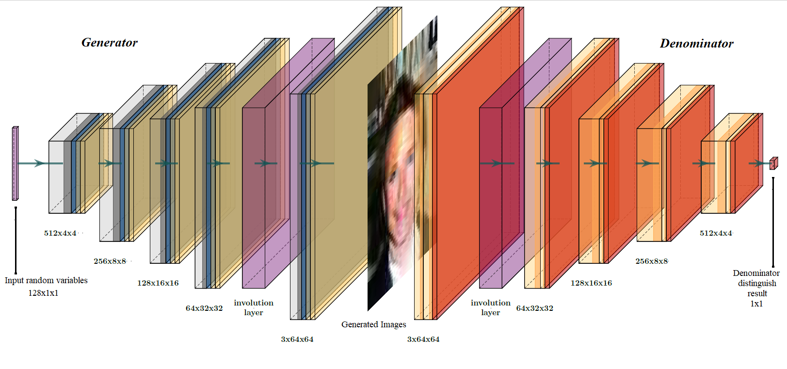

# Involution GAN

Run the main.py and set parameters.py

* you can download
  - MNIST dataset: http://yann.lecun.com/exdb/mnist/
  - CelebA dataset: http://mmlab.ie.cuhk.edu.hk/projects/CelebA.html

## Acknowledgement
We thanks to the code from 
  - https://github.com/heykeetae/Self-Attention-GAN
  - https://github.com/ChristophReich1996/Involution
  - https://github.com/mseitzer/pytorch-fid

## Network Structure

## Sample

## Experiment Result

## Report 
paper_33.pdf

## Slides
slides_33.pdf

